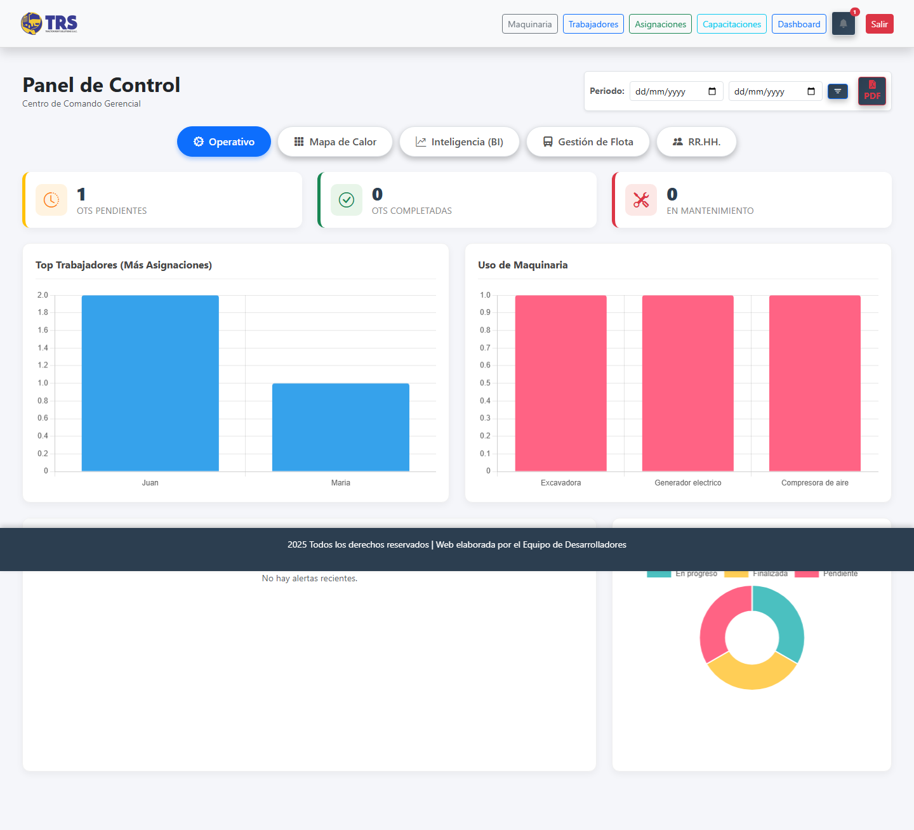
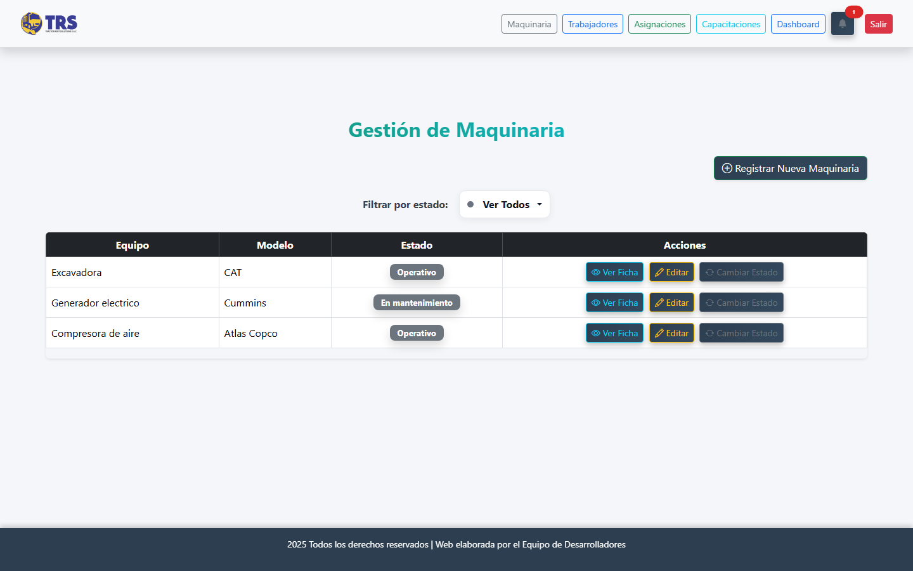
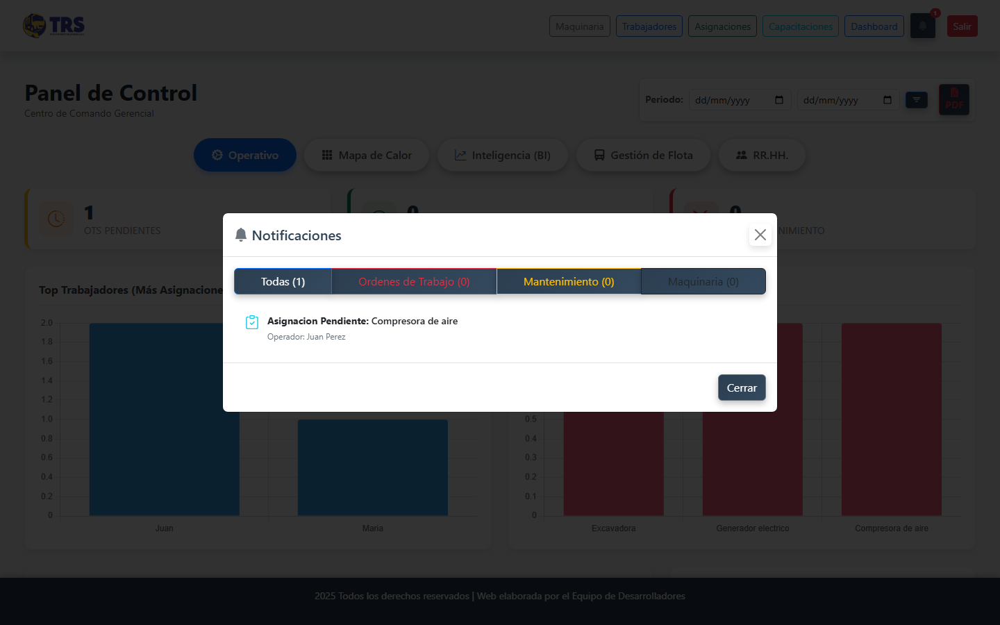

# TRS Notificaciones

Sistema web de gestión de maquinaria y trabajadores con notificaciones en tiempo real de mantenimientos, asignaciones y eventos.

## Problema / contexto

Proyecto propio, sin cliente ni terceros de por medio. Lo construí para llevar el control de maquinaria, el personal asignado a cada equipo y las alertas de mantenimiento, todo en un solo sistema.

El sistema estuvo desplegado en producción real en el dominio `trsadmin.site`, sobre un hosting compartido de GoDaddy administrado con cPanel (Passenger WSGI).

## Stack

- **Backend:** Django 4.2.13 (Python 3.9)
- **Base de datos:** MySQL
- **Almacenamiento de imágenes:** Cloudinary
- **Despliegue original:** cPanel + Passenger WSGI (GoDaddy)
- **Configuración:** variables de entorno con `python-decouple`

## Cómo correrlo localmente

### 1. Clonar e instalar dependencias

```bash
git clone <este-repo>
cd trs-notificaciones
python -m venv venv
venv\Scripts\activate       # Windows
source venv/bin/activate    # Linux / Mac
pip install -r requirements.txt
```

### 2. Variables de entorno

Copia `.env.example` a `.env` y completa tus propios valores (clave secreta, credenciales de tu base de datos MySQL local y credenciales de tu propia cuenta de Cloudinary):

```bash
cp .env.example .env
```

### 3. Base de datos

Crea una base de datos MySQL vacía con el nombre que pusiste en `DB_NAME` y aplica las migraciones:

```bash
python manage.py migrate
```

### 4. Crear un usuario administrador

```bash
python manage.py createsuperuser
```

### 5. Levantar el servidor

```bash
python manage.py runserver
```

El sistema queda disponible en `http://127.0.0.1:8000/`.

## Capturas


*Panel de control con órdenes pendientes/completadas, ranking de trabajadores y uso de maquinaria (datos de demostración).*


*Gestión de maquinaria: listado con estado (operativo / en mantenimiento) y acciones de edición (datos de demostración).*


*Notificaciones en tiempo real sobre asignaciones y estado de la maquinaria, accesibles desde el ícono de campana (datos de demostración).*
