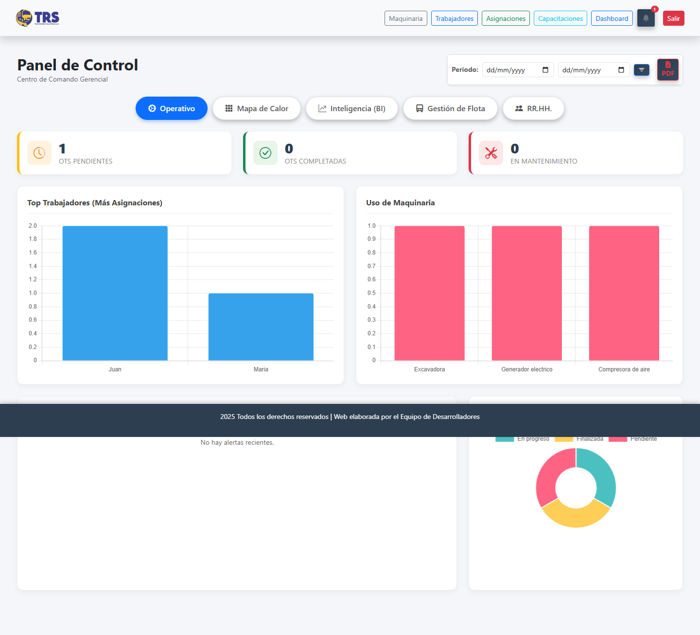
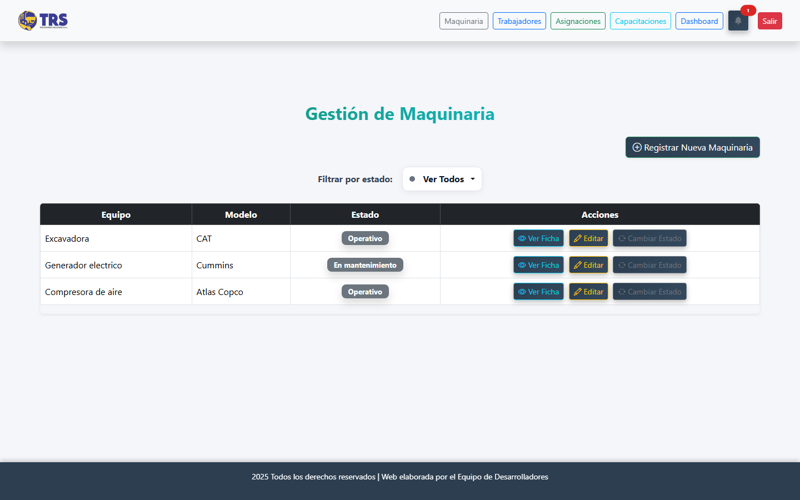
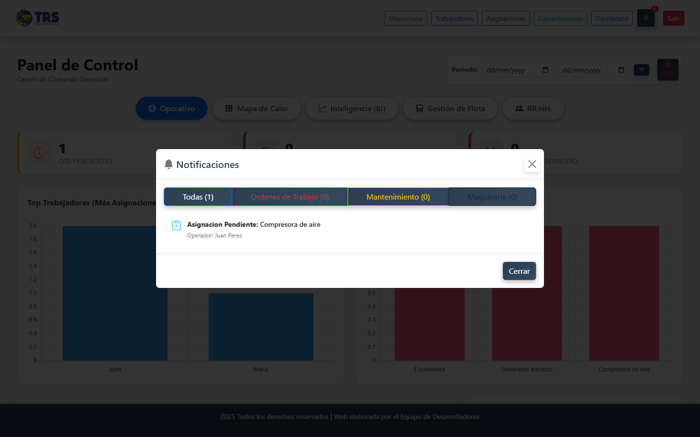

# TRS Notificaciones

Sistema web en Django para la gestión de maquinaria y trabajadores, con seguimiento de asignaciones, mantenimientos y notificaciones operativas.

## Contexto

Proyecto propio desarrollado para centralizar el control de equipos, personal asignado y alertas de mantenimiento en una sola aplicación web.

El sistema estuvo desplegado en producción en `trsadmin.site` mediante hosting compartido de GoDaddy con cPanel y Passenger WSGI. El repositorio actual conserva únicamente la configuración necesaria para ejecutar una versión local del proyecto.

## Funcionalidades principales

- Gestión de maquinaria y estado operativo.
- Gestión de trabajadores y asignaciones.
- Seguimiento de órdenes y mantenimientos.
- Notificaciones sobre asignaciones y eventos operativos.
- Dashboard con métricas y gráficos.
- Gestión de imágenes mediante Cloudinary.
- Configuración sensible mediante variables de entorno.

## Stack tecnológico

- **Backend:** Python 3.9, Django 4.2.13
- **Base de datos:** MySQL
- **Imágenes:** Cloudinary
- **Despliegue original:** GoDaddy, cPanel, Passenger WSGI
- **Configuración:** `python-decouple`

## Ejecución local

### 1. Clonar e instalar dependencias

```bash
git clone https://github.com/pansitozzz/trs-notificaciones.git
cd trs-notificaciones
python -m venv venv

# Windows
venv\Scripts\activate

# Linux / macOS
# source venv/bin/activate

pip install -r requirements.txt
```

### 2. Variables de entorno

Copiar `.env.example` como `.env` y completar las variables requeridas:

```bash
cp .env.example .env
```

### 3. Base de datos

Crear una base de datos MySQL vacía con el nombre definido en `DB_NAME` y ejecutar:

```bash
python manage.py migrate
```

### 4. Usuario inicial

La aplicación utiliza un modelo propio de trabajador para autenticación. Para crear un usuario local de administración:

```bash
python manage.py crear_trabajador_admin --usuario admin --password "elige-una-password-segura"
```

### 5. Ejecutar

```bash
python manage.py runserver
```

La aplicación queda disponible en `http://127.0.0.1:8000/`.

## Capturas


*Panel de control con órdenes pendientes y completadas, ranking de trabajadores y uso de maquinaria. Los datos mostrados son de demostración.*


*Gestión de maquinaria y estado operativo con acciones de edición.*


*Notificaciones sobre asignaciones y cambios en el estado de la maquinaria.*

## Seguridad y datos

Las credenciales, claves y configuraciones específicas del entorno se gestionan mediante variables de entorno. El repositorio público no debe contener información de producción ni datos personales reales.
